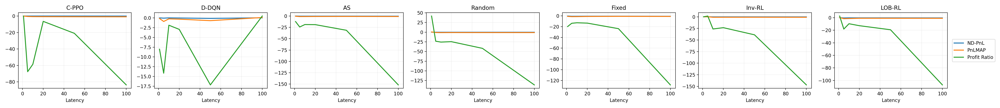
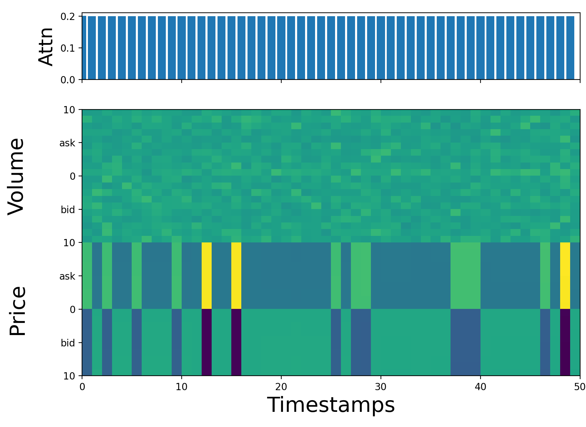
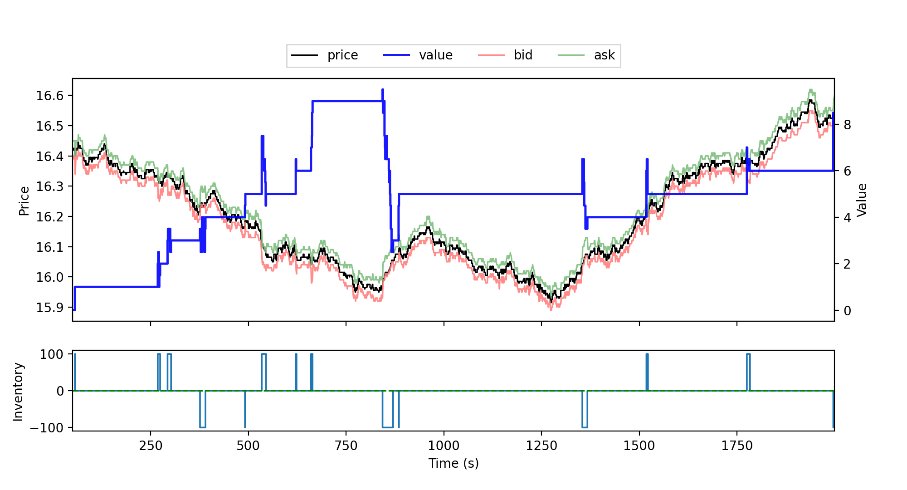

# Replication Tables and Figures

## Table I. PRE-TRAIN RESULTS.

|  | Precision | Recall | F1 | Param (paper-reported encoder) | Input |
| --- | --- | --- | --- | --- | --- |
| FC-LOB | 0.3161 | 0.3181 | 0.3164 | 256,064 | 4000 x 1 |
| Conv-LOB | 0.1827 | 0.3333 | 0.2360 | 172,320 | 1024 x 40 |
| DeepLOB | 0.1827 | 0.3333 | 0.2360 | 139,168 | 100 x 40 |
| Attn-LOB | 0.1827 | 0.3333 | 0.2360 | 176,320 | 50 x 40 |

## Table II. OVERALL RESULTS.

|  | ND-PnL (x1e5) | PnLMAP | PR (x1e-4) | Sharpe |
| --- | --- | --- | --- | --- |
| C-PPO | 0.00 | 0.00 | 0.00 | — |
| D-DQN | -0.01 | -0.06 | -3.51 | — |
| Inv-RL | 0.00 | 0.00 | 0.00 | — |
| LOB-RL | 0.03 | 0.14 | 2.66 | — |
| AS | -0.05 | -0.52 | -12.24 | — |
| Random | 0.05 | 0.57 | 41.68 | — |
| Fixed_1 | -0.36 | -0.98 | -19.88 | — |
| Fixed_2 | — | — | — | — |
| Fixed_3 | — | — | — | — |

## Figure 2. Latency experiments.

## Table III. THE RUNTIME OF METHODS.

| Method | Random | Fixed | AS | D-DQN Infer | D-DQN Train | C-PPO Infer | C-PPO Train |
| --- | --- | --- | --- | --- | --- | --- | --- |
| Runtime (ms/ts) | 0.1 | 0.1 | 0.1 | 3.9 | 39.2 | 4.8 | 13.8 |

## Table IV. ABLATION EXPERIMENTS.

|  | ND-PnL (x1e5) | PnLMAP | Profit Ratio (x1e-4) | Sharpe |
| --- | --- | --- | --- | --- |
| C-PPO | 0.00 | 0.00 | 0.00 | — |
|   w/o LOB state | 0.00 | 0.00 | 0.00 | — |
|   w/o Attn-LOB | 0.00 | 0.00 | 0.00 | — |
|   w/o Dynamic state | 0.00 | 0.00 | 0.00 | — |
| D-DQN | 0.04 | 0.22 | 7.27 | — |
|   w/o LOB state | -0.04 | -0.22 | -8.84 | — |
|   w/o Attn-LOB | 0.02 | 1.29 | 4.01 | — |
|   w/o Dynamic state | 0.05 | 3.94 | 12.02 | — |

## Figure 3. Attention visualization.

## Figure 4. Decision visualization.

